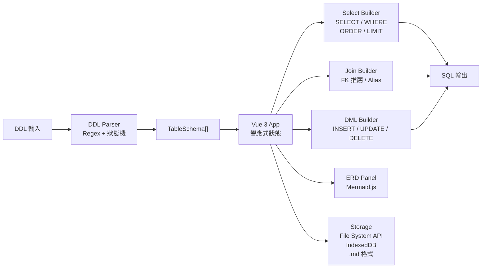

# Prism SQL Builder

離線 SQL Query Builder。貼入 DDL，視覺化選欄，即時產生 SQL。

---

## 特色

- **零安裝、零依賴**：單一 HTML 檔，複製即用
- **完全離線**：所有邏輯在瀏覽器本地執行，資料不外傳
- **多方言支援**：MySQL / PostgreSQL / MSSQL / Oracle
- **深淺色模式**：預設淺色，可切換深色

---

## 功能

| 功能 | 說明 |
|------|------|
| DDL 解析 | 支援 MySQL / PostgreSQL / MSSQL（`[bracket]`）語法 |
| SELECT 查詢 | 欄位勾選、WHERE 條件、ORDER BY、LIMIT / OFFSET |
| JOIN 查詢 | FK 自動推薦、INNER / LEFT / RIGHT JOIN、欄位衝突自動加前綴 |
| DML 模板 | INSERT / UPDATE / DELETE，支援 named（`:col`）與 positional（`?`）佔位符 |
| ERD 關聯圖 | Mermaid.js 自動繪製，點擊節點跳至查詢設定 |
| 查詢管理 | 同一 Schema 下可儲存多組查詢，命名後一鍵還原 |

---

## 使用方式

### 開發

```
# 直接用 Chrome / Edge 開啟（需先產生 tailwind.css）
./tailwindcss.exe -i ./src/input.css -o ./tailwind.css --minify
start index.html
```

> 僅支援 Chrome / Edge（需要 File System Access API）

### 打包為離線單檔

雙擊 `build.bat`，自動產生 `prism.html`（約 3–4 MB，含所有依賴）。

**前置條件（首次）：**

```powershell
# 下載 Tailwind CSS 獨立執行檔（123 MB，存於專案根目錄）
curl -LO https://github.com/tailwindlabs/tailwindcss/releases/latest/download/tailwindcss-windows-x64.exe
Rename-Item tailwindcss-windows-x64.exe tailwindcss.exe
```

> PowerShell 7（`pwsh`）需已安裝。

---

## 資料儲存

App 啟動時顯示開始畫面，需主動選擇：

| 選項 | 說明 |
|------|------|
| 開啟 Schema 檔案 | 載入現有 `.md` 檔，後續直接覆寫儲存 |
| 選擇儲存位置 | 指定資料夾，往後儲存自動寫入 `{名稱}.md`，資料夾由 IndexedDB 記憶 |
| 先試試看 | 不設定儲存，手動匯出 |

`.md` 格式人類可讀，適合版控，換電腦複製檔案即可還原。

---

## 流程架構

### 使用者流程


### 程式碼架構



---

## 專案結構

```
src/
  parser/     # DDL Parser（Regex + 狀態機）
  builder/    # SQL Builder（SELECT / JOIN / DML）
  storage/    # File System API / IndexedDB / .md 格式
  components/ # Vue 3 元件
  app.js      # 應用程式入口
scripts/
  build.ps1   # 離線打包腳本
build.bat     # 一鍵打包（雙擊執行）
```

---

## 技術棧

| 用途 | 技術 |
|------|------|
| UI 框架 | Vue 3（CDN，發布時 inline） |
| 樣式 | Tailwind CSS v4（獨立執行檔，不需 npm） |
| ERD 圖表 | Mermaid.js（CDN，發布時 inline） |
| DDL 解析 | 自製 Parser |
