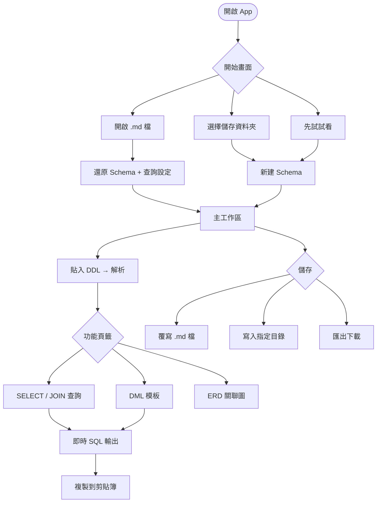
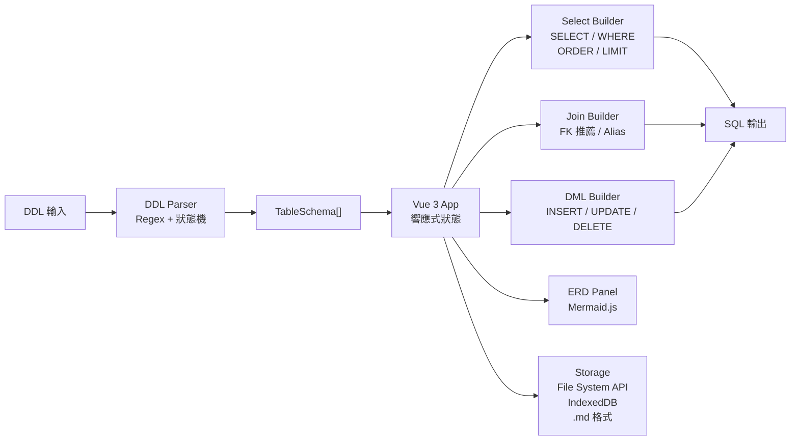

# Prism SQL Builder

離線 SQL Query Builder。用 Chrome / Edge 開啟單一 `prism.html`，貼入或匯入 DDL，視覺化選欄並即時產生 SQL。

**[線上試用 →](https://lingaoscar.github.io/Prism-SQL-Builder/)**

[](https://github.com/LinGaOscar/Prism-SQL-Builder/actions/workflows/deploy.yml)

---

## 特色

- **零安裝、零依賴**：單一 HTML 檔，複製即用
- **完全離線**：所有邏輯在瀏覽器本地執行，資料不外傳
- **多方言支援**：MySQL / PostgreSQL / MSSQL / Oracle
- **檔案式儲存**：以 `.md` 保存 DDL 與查詢設定，適合搬移與版控
- **深淺色模式**：預設淺色，可切換深色

---

## 功能

| 功能 | 說明 |
|------|------|
| DDL 解析 | 支援 MySQL / PostgreSQL / MSSQL 常見 `CREATE TABLE`，含 `[bracket]` 與 `schema.table` |
| SELECT 查詢 | 欄位勾選、WHERE 條件、ORDER BY、LIMIT / OFFSET |
| JOIN 查詢 | FK 自動推薦、INNER / LEFT / RIGHT JOIN、欄位衝突自動加 `table.column` 前綴 |
| DML 模板 | INSERT / UPDATE / DELETE，支援 named（`:col`）與 positional（`?`）佔位符 |
| ERD 關聯圖 | Mermaid.js 自動繪製，點擊節點跳至查詢設定 |
| 查詢管理 | 同一 Schema 下可儲存多組查詢，命名後一鍵還原 |

---

## 使用方式

### 支援環境

目前僅支援 Chrome / Edge。App 啟動時會阻擋其他瀏覽器，因核心儲存流程依賴 File System Access API。

### 開發

```
# 直接用 Chrome / Edge 開啟（需先產生 tailwind.css）
./tailwindcss.exe -i ./src/input.css -o ./tailwind.css --minify
start index.html
```

開發版 `index.html` 仍使用外部 Vue / Mermaid CDN；離線使用請打包成 `prism.html`。

### 打包為離線單檔

雙擊 `build.bat`，自動產生 `prism.html`（目前約 3.28 MB，含所有依賴）。

**前置條件（首次）：**

```powershell
# 下載 Tailwind CSS 獨立執行檔（123 MB，存於專案根目錄）
curl -LO https://github.com/tailwindlabs/tailwindcss/releases/latest/download/tailwindcss-windows-x64.exe
Rename-Item tailwindcss-windows-x64.exe tailwindcss.exe
```

> PowerShell 7（`pwsh`）需已安裝。

打包流程會：

1. 用 `tailwindcss.exe` 產生 `tailwind.css`
2. 由 `scripts/build.ps1` inline `tailwind.css`、Vue、Mermaid、所有 `src` 模組
3. 輸出 `prism.html`

`prism.html`、`tailwind.css`、`vendor/` 都是本地生成物，不需要 commit。

---

## CI / CD 部署

每次推送至 `main` branch，GitHub Actions 自動建置並部署至 GitHub Pages。

### 執行者

由 **GitHub 雲端 Runner**（`ubuntu-latest` 虛擬機）負責執行，每次都是全新乾淨環境，跑完即銷毀。

### 為什麼能執行 `build.ps1`？

GitHub 的 `ubuntu-latest` Runner **預裝了 PowerShell Core（`pwsh`）**，可直接跑跨平台 `.ps1` 腳本，無需額外安裝。

### 執行流程

```
git push → GitHub 偵測 main 有新 commit
  → 分配 ubuntu-latest 虛擬機
    → checkout repo
      → 下載 tailwindcss 執行檔
        → 產生 tailwind.css
          → pwsh build.ps1 → dist/index.html
            → 上傳 artifact → 部署至 GitHub Pages
              → 虛擬機銷毀
```

---

## 資料儲存

App 啟動時顯示開始畫面，需主動選擇：

| 選項 | 說明 |
|------|------|
| 開啟 Schema 檔案 | 載入現有 `.md` 檔，後續直接覆寫儲存 |
| 選擇儲存位置 | 指定資料夾，往後儲存自動寫入 `{名稱}.md`，資料夾由 IndexedDB 記憶 |
| 先試試看 | 不設定儲存，手動匯出 |

`.md` 格式人類可讀，適合版控，換電腦複製檔案即可還原。

localStorage 只保存主題偏好，不保存 DDL 或查詢設定。

---

## DDL 支援重點

支援常見 `CREATE TABLE` 寫法：

```sql
CREATE TABLE users (
  id INT PRIMARY KEY,
  name VARCHAR(100) NOT NULL
);

CREATE TABLE [dbo].[orders] (
  id INT PRIMARY KEY,
  user_id INT,
  FOREIGN KEY (user_id) REFERENCES [dbo].[users](id)
);
```

已涵蓋：

- 反引號、雙引號、MSSQL 方括號識別符
- `CREATE TABLE IF NOT EXISTS`
- `schema.table` / `[schema].[table]`
- 行內與表級 `PRIMARY KEY`
- 表級 `FOREIGN KEY`
- `AUTO_INCREMENT`、`SERIAL`
- `DEFAULT (...)`
- 跳過 `UNIQUE`、`INDEX`、`KEY` 表級定義

Parser 測試目前為 `19 PASS / 0 FAIL`。

---

## 流程架構

### 使用者流程



### 程式碼架構



---

## 專案結構

```
src/
  parser/     # DDL Parser（Regex + 狀態機）
  builder/    # SQL Builder（SELECT / JOIN / DML）
  storage/    # File System API / IndexedDB / .md 格式
  components/ # Vue 3 元件
  app.js      # 應用程式入口
scripts/
  build.ps1   # 離線打包腳本
build.bat     # 一鍵打包（雙擊執行）
```

---

## 技術棧

| 用途 | 技術 |
|------|------|
| UI 框架 | Vue 3（CDN，發布時 inline） |
| 樣式 | Tailwind CSS v4（獨立執行檔，不需 npm） |
| ERD 圖表 | Mermaid.js（CDN，發布時 inline） |
| DDL 解析 | 自製 Parser |

---

## 已知限制

- 僅支援 Chrome / Edge。
- `prism.html` 目前約 3.28 MB；若要壓到 3 MB 以下，需要另做 Mermaid 或 vendor 壓縮策略。
- DDL parser 以常見 `CREATE TABLE` 為主，非標準或高度方言化語法可能需要先簡化後匯入。
